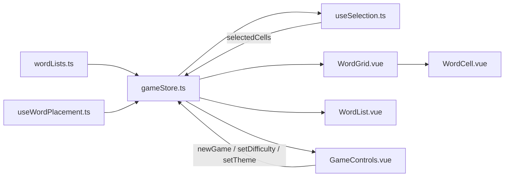
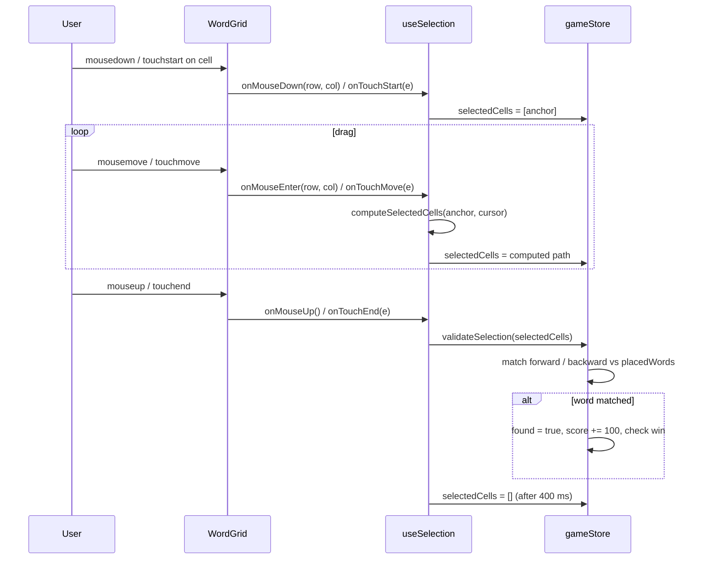
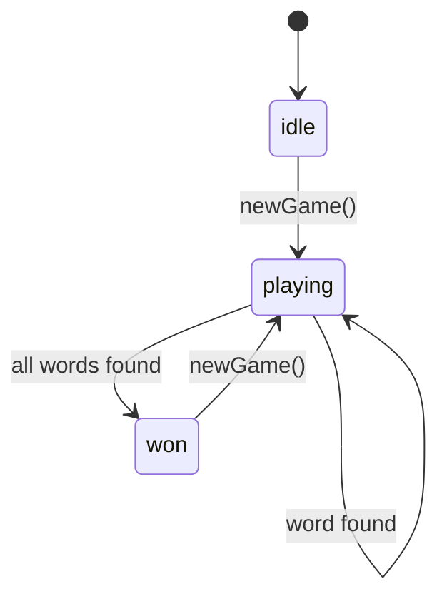

# CLAUDE.md

This file provides guidance to Claude Code (claude.ai/code) when working with code in this repository.

## Commands

```bash
npm run dev        # start Vite dev server
npm run build      # type-check then bundle for production
npm run preview    # serve the production build locally
npm run typecheck  # vue-tsc --noEmit (no test runner configured)
```

There is no linter or test suite configured. Type-checking (`npm run typecheck`) is the primary correctness gate.

## Architecture

The app is a single-page word-search game with no routing. State flows in one direction: the Pinia store owns all game data; components read from it reactively and write back only through store actions.

### Data flow



### Drag-selection → validateSelection sequence



### Game state machine



### Key design decisions

**`gameStore.ts`** is the single source of truth. It owns the grid (`Cell[][]`), placed words (`PlacedWord[]`), selection state (`selectedCells`, `highlightedWordIndices`), timer, score, and game-over flags. `validateSelection()` is the only place where a drag result is evaluated — it compares the selected cell sequence (forward and backward) against every unmatched `PlacedWord`.

**`useWordPlacement.ts`** is pure logic with no Vue reactivity. It receives a pre-built empty `Cell[][]` and a word pool, places words via random position/direction sampling (up to 50 attempts per direction per word), writes letters directly into the grid cells, and returns the mutated grid plus a `PlacedWord[]` array. Empty cells are filled with random letters in `gameStore.newGame()` after placement.

**`useSelection.ts`** bridges DOM events to store state. Mouse and touch paths both resolve to `(row, col)` coordinates — touch uses `document.elementFromPoint` to find the cell under the finger. The composable calls `store.validateSelection()` on drag end and clears `store.selectedCells` after a short delay so the user can see the selection before it disappears.

**`WordGrid.vue`** sets `touch-action: none` on the grid container and binds touch handlers at the container level (not per-cell) to avoid registering hundreds of listeners. It computes a responsive `cellSize` from `window.innerWidth` so the grid fits within `min(480px, 90vw)` on any screen.

**`WordCell.vue`** derives its visual state (`isSelected`, `isFound`) purely from store data — it never holds local state.

### Grid cell structure

```ts
interface Cell {
  letter: string
  row: number
  col: number
  wordIndices: number[]   // indices into placedWords[] for highlight lookup
}
```

`wordIndices` allows a cell shared by multiple crossing words to belong to all of them.

### Adding a new word theme

Add an entry to `wordThemes` in `src/data/wordLists.ts` and add its key to the `Theme` union type. The store and controls pick it up automatically.

### Adding a new difficulty level

Add entries to `DIFFICULTY_SIZE`, `DIFFICULTY_WORDS`, and `DIFFICULTY_TIME` in `gameStore.ts`, and add a `{ value, label }` entry to the `difficulties` array in `GameControls.vue`.
